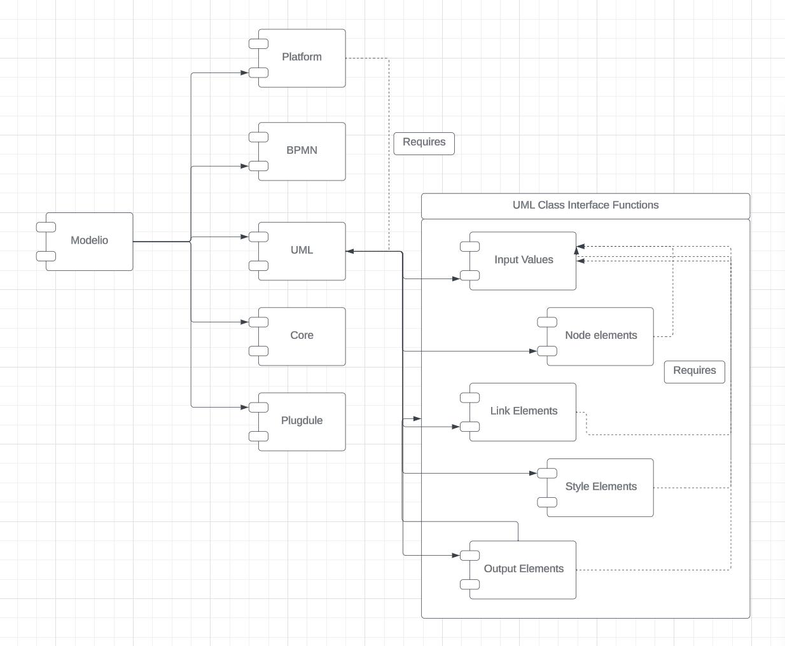
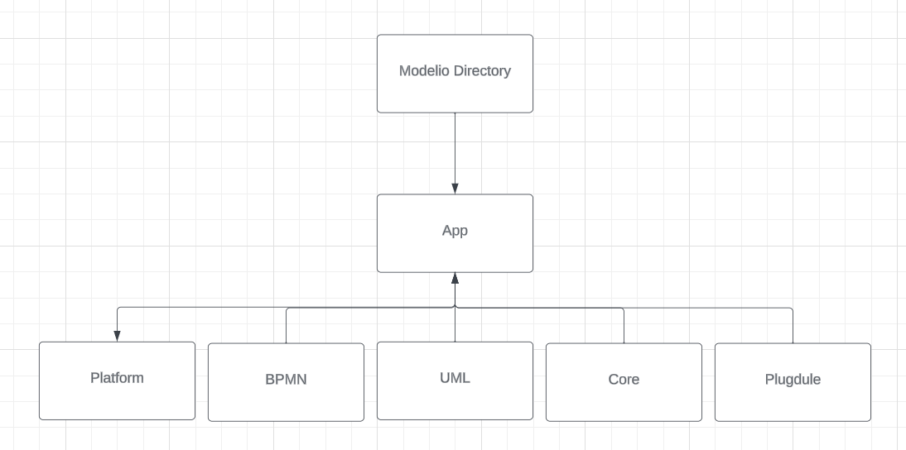

# Project 2: Modelio

We decided to choose Modelio for our Project 2. Modelio is an open-source modeling tool and modeling environment designed for different software engineering activities. Modelio is a software system that facilitates the creation, analysis, and management of various models such as UML diagrams, BPMN diagrams, Java, Python, and more. Users can use Modelio to visually design and document software architectures, data models, etc. It provides a simplified, user-friendly interface for collaborative modeling, code generation, integration and other software development tools. Modelio is a valuable resource for software developers, system architects, and business analysts who wish to improve their modeling and design processes. This open-source software was created by Modeliosoft, based in Paris, France. This open-source software was created by Modeliosoft, a company based in Paris, France.


## **Context and Background**

### Modelio Overview

Modelio is an open-source modeling tool and modeling environment designed for different software engineering activities. Modelio is a software system that facilitates the creation, analysis, and management of various models such as UML diagrams, BPMN diagrams, Java, Python, and more. Users can use Modelio to visually design and document software architectures, data models, etc. It provides a simplified, user-friendly interface for collaborative modeling, code generation, integration and other software development tools. Modelio is a valuable resource for software developers, system architects, and business analysts who wish to improve their modeling and design processes. 

### Creators and Maintenance

This open-source software was created by Modeliosoft, a company based in Paris, France. The package is open source and hosted on GitHub, which allows anyone to contribute to its development. The team at Modelio and the creators oversee its ongoing maintenance and development and have ongoing updates to provide support and a better experience for their users. 

### Main Features

* **Versatile Modeling Environment:** Modelio offers a comprehensive modeling platform accommodating various models and diagrams, aiding users with consistency checks and model assistance.
* **Unified BPMN and UML Support:** Seamlessly integrates BPMN (Business Process Model and Notation) alongside UML (Unified Modeling Language), facilitating specialized diagrams for business process modeling within a single tool.
* **Java Code Generation:** The Java Designer module within Modelio utilizes an Eclipse-style project file structure to generate and reverse Java code, aiding in Javadoc creation and Java automation.
* **XMI Import/Export:** Modelio includes support for XMI (XML Metadata Interchange) for exchanging UML2 models across different modeling tools.
* **HTML Model Publishing:** Through the HTML Publisher module, users can publish their models in HTML format for easier sharing and accessibility.
* **Flexible Extension System:** Modelio's modular design allows for easy extension, enabling integration with diverse languages, methodologies, and modeling techniques by adding custom modules to the configuration.
* **Scripting Language Support (Jython):** Integrates support for Jython scripting language, enhancing flexibility in performing various tasks within the modeling environment.


**Additional Information**
To learn more about Modelio, here are some valuable links and websites:

**Modelio Websites:**

* **[https://www.modelio.org/index.htm](https://www.modelio.org/index.htm)**

This is the official website to download and use the extensible modeling environment. On this site, they include the recent updates and what is new in each version.

* **[https://www.modeliosoft.com/en/](https://www.modeliosoft.com/en/)**

This is the Modelio version that allows for collaborative Business or Software modeling. 

* [https://github.com/ModelioOpenSource/Modelio](https://github.com/ModelioOpenSource/Modelio)

This is the official Github repository for Modelio stands as the source hosting Modelio’s system code, utilities, and documentation. It serves as a central point for accessing, understanding, and using Modelio and also keeps the users informed about the latest updates and improvements and allows them to download it for usage. 

## **Development View:**

**Legend**:
**Solid Line**: Shows that a relationship exists between the components
**Dashed Line**: The component that the arrow is coming from requires the component it is pointing to in order to run

**Modelio:** Major component that includes sub-components for different aspects of the applications:

1. **Platform**: Encompoasses platform-specific components like API, core platform functionalities, MDA infrastructure, UI components, search engine, and update repository
2. **BPMN**: Related to the BPMN diagram editor and its metamodel
3. **UML**: Related to UML diagrams and their editors, metamodel API, and UI components
   Input Values: Data or parameters provided to specific functionalities or processes within the UML-related components such as user-defined properties,   configurations, settings, etc.
Node Elements: Represents the individual components or entities in a diagram such as classes, interfaces, packages, or objects.
Link Elements: Refer to the connections or relationships between the various nodes or components depicted in the diagrams. They represent associations, dependencies, inheritance, or other relationships between classes, objects, or other UML entities. 
Style Elements: Style elements in UML pertain to the visual appearance or formatting applied to the elements within the diagrams. This includes information such as colors, fonts, line styles, etc. 
Output Elements: Refers to the results or outputs generated from UML-related processes or functionalities. 
4. **Core**: Includes core functionalities like kernel, metamodel API, project data, session management, and utilities
5. **Plugdule**: Contains the Modelermoduel component

### High-Level Codeline Model
The Modelio directory has many components with the  main components being under the App. The “Modelio” repository contains the modules that we included in our UML diagram such as Platform, BPMN, UML, Core, and Plugdule which we determined to be the main features of the Modelio Repository. Focusing on these elements allows us to gain an understanding of the Modelio capabilities on a higher level. 


#### Testing
In this Modelio GitHub Repository, there are no testing practices which indicates a lack of automated testing integration within the codebase.  Additionally,, there is no external Contribution Github Repo that is specified  anywhere throughout the repo. This suggests a potential opportunity to improve the development process by implementing robust  testing. Without specific documentation or configuration for testing, the process for running tests in Modelio is not clear.  Generally, in standard Java projects, the tests are usually run as part of the build process. 

#### Configuration
The pom.xml file indicates that Modelio uses Maven for its build process and is also configured for Java 11. The build process includes various plugins and dependencies, suggesting that a proper Maven and Java environment is necessary to build and use the system. There are no explicit instructions for using git branches or tags for building Modelio. 


## **Applied Perspective:**

For the analysis of Modelio, we have chosen to consider this system from the evolution perspective. The evolution perspective is concerned with the system’s ability to be flexible with the change that comes with deploying changes and balancing that with the costs of providing this flexibility. This perspective is important to our system because of how it is used by its users and the frequent updates that come with Modelio. 

### **Applying the Perspective**

There are a few main concerns that we can see through the Evolution perspective that are relevant to the Modelio System. 

* **Dimensions of Change:** Within the category of Dimensions of Change, we believe that Integration Evolution and growth are extremely important to the long term stability of Modelio. Modelio has the ability to build diagrams and models from external files and coding languages. With this in mind, we can think about how this system is integrated with other external packages and platforms needing to ensure that it is flexible enough to change with those systems. 

* **Likelihood of Change:** Modelio prioritizes user and business needs by adapting to evolving trends in coding languages and models. The trends are constantly changing, meaning that having a system that is malleable, will allow for smoother and more efficient integration. 


**Identify Styles & Patterns Used:**

### **Architectural Style**


The architectural style of Modelio can be best described as **Layered**. In a Layered architecture, the application is divided into layers with a **Presentation** layer that handles UI. In the context of Modelio, this would be the part of the application that deals with rendering the UML diagrams and the user interface for model editing and other visual elements that the user interacts with. The **Logic** layer contains the core functionality of processing commands and making logic decisions. For Modelio, this handles the creation, manipulation and management of UML and BPMN models. It includes the rules and logic for how models are structured and maintained. Lastly, there is the **Data Access** layer, which is supposed to manage data persistence and retrieval. In Modelio, this layer manages the storage and retrieval of model data, possibly interacting with file systems to save and load models. 

### **Design Patterns**

**Pattern 1: Decorator**

modelio/platform/platform.api/src/org/modelio/api/modelio/diagram/IDGDynamicDecorator.java

The decorator pattern is an architectural pattern that lets you attach new behaviors to objects by placing these objects inside wrapper objects that contain the behaviors. The **IDGDynamicDecorator** interface located inside of modelio’s platform component is a textbook implementation of the decorator architectural pattern. The interface is designed to decorate UML diagram graphics with specific properties in customized diagrams. It allows dynamic overwriting of graphical properties on any element in a diagram. This means that specific visual aspects of a diagram element can be altered and added “as decoration” without changing the element itself or other elements of the same type. The interface defines a **decorate(IOOverwrittenProperties context)** method, which is the key to adding new behaviors, grouping the currently edited element and its overwritten graphical properties. Inside this interface, there is another nested interface that provides the context for the decorator with methods to set certain decorator properties like **setFont(), setLineColor(), setLineWidth()**, which act as the decorative elements. 

**Pattern 2: Composite Pattern**

In the PatternCatalogPanel class (modelio/app/app.patterns/src/org/modelio/patterns/catalog/gui/PatternCatalogPanel.java), the Composite pattern is primarily being used in the graphical user interface elements. The Composite pattern lets you compose objects into tree structures and then work with these structures as if they were individual objects.The file is using **Composite** objects from the Standard Toolkit library that act as containers to hold other widgets, including other **Composite** widgets. This is a typical use of the pattern where the containers of objects and the objects themselves are treated in the same manner. Additionally, there is a **createIdentificationPanel(Composite parent)** method inside this file that takes in a **Composite** parent and returns another **Composite** object (which is created using a **Group**) that is a panel of various labels and text fields. This method demonstrates how individual components (labels, text fields) and their **Composite** container (**Group**) are handled uniformly. This approach simplifies the GUI design and makes the code more manageable and scalable.

**Pattern 3: Adapter Pattern**

The SelectionHelper class (modelio/app/app.xmi/src/org/modelio/xmi/handlers/SelectionHelper.java) uses the Adapter pattern to convert various types of objects into a unified type or interface, allowing for more flexible code. The Adapter pattern allows objects with incompatible interfaces to collaborate. There are methods provided to adapt different types of objects into a common interface or type. The code uses the **IAdaptable** interface, where the code checks if an object is an instance of **IAdaptable**. If it is, it uses the **getAdapter()** method to adapt it to the **MObject** class. This is a typical use of the Adapter pattern, where **IAdaptable** acts as an adapter interface allowing different objects to be adapted to **MObject.**

## **Architectural Assessment:**

### **Open Closed Principle**

In the Modelio codebase, the Open Closed Principle is evident in various parts. The principle suggests that software entities should be open for extension but closed for modification. One prime example of this principle in action is the **AbstractJavaModule** abstract class and the design allows for extension of its behavior by subclassing. Different modules can extend this class and provide specific implementations for abstract methods or override existing behaviors. The class also provides extension points through the use of several methods that can be overridden by subclasses (which adheres to the “open for extension but closed for modification” part of the principle). **getModuleImagePath()** and **getDescription()** for example, are methods that can be implemented differently in derived classes, allowing for customization without modifying the base class. 

### **Liskov Substitution Principle**

From a high level, the Liskov Substitution Principle states that in an object-oriented program, if we substitute a superclass object reference with an object of any of its subclasses, the program should not break. For context of how this principle is used, the “core” component of the Modelio codebase, serves various purposes in the context of creating UML diagrams as well as Business Process Model and Notation. There is a section in the codebase that is dedicated towards maintaining the base functionalities for BPMN elements, which provide the common features and properties that are shared across different BPMN elements like tasks, events, gateways, etc. For example, the **BPMNItemAwareElementImpl** class, which is an abstract class extending **BPMNFlowElementImpl** and implementing the **BPMNItemAwareElement** interface, provides methods like **getTargetofDataAssociation(), getItemSubjectRef(), setDataState()**. These methods are overridden in **BPMNItemAwareElementImpl()** and provide specific implementations while maintaining the contract defined by the base class and interface, adhering to the LSP.

## **System Improvement**

### **Refactoring**
The key changes that we made were inside of the ModelSearchPanel class. This class creates and manages a search panel on the Modelio platform. It sets up the UI elements and enables the functionality to search UML model elements. The **initialize()** method sets up the UI components of the search panel on the page. Within the **initialize()** method, there is a grid layout created with elements like labels, text fields and checkboxes being added. There’s also search criteria handler functions that specify what to do when a user selects certain search criteria. Previously, the logic for setting up all of these distinct elements was located within the initialize() function and was long, verbose and its function was not immediately clear. Therefore we used the extract function refactoring principle and consolidated all of the different element initializations into different functions. For example, the logic for setting up a case sensitive checkbox on the page has now been isolated in a **setupCaseSensitiveCheckbox()** function. 

```
private void setupCaseSensitiveCheckbox() {
   this.caseSensitiveCheckBox = new Button(this.topGroup, SWT.CHECK);
   this.caseSensitiveCheckBox.setText("");
   this.caseSensitiveCheckBox.setToolTipText(CoreUi.I18N.getString("ModelSearch.NameCase.tooltip"));
   gridData = new GridData(SWT.RIGHT, SWT.CENTER, false, false);
   this.caseSensitiveCheckBox.setLayoutData(gridData);


}


private void setupCaseSensitiveCheckboxEventListeners() {
   this.caseSensitiveCheckBox.addSelectionListener(new SelectionAdapter() {
       @Override
       public void widgetSelected(SelectionEvent e) {
           // TODO Auto-generated method stub
           super.widgetSelected(e);
           ModelSearchPanel.this.searchController.runSearch();
       }
   });
}
```


